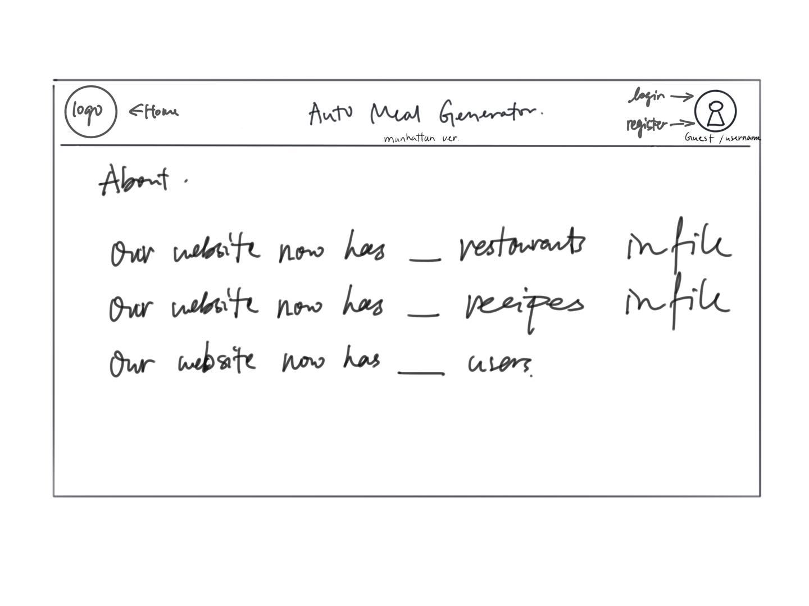

## Wireframes

/api/connect/register - page for registration

/api/connect/login - page for login

/api/connect/home - page for home page that will appear the first

/api/connect/home - page for home page that will appear the second

/api/connect/restaurant-pref - page for selecting preference for today's restaurant

/api/connect/recipe-pref - page for selecting preference for today's recipe

/api/connect/restaurant - page for showing specific restaurant

/api/connect/recipe-details - page for showing specific recipe

/api/connect/about - page for general information of the website

## Site map

Here's the [Site Map](documentation/site-map.jpg)
